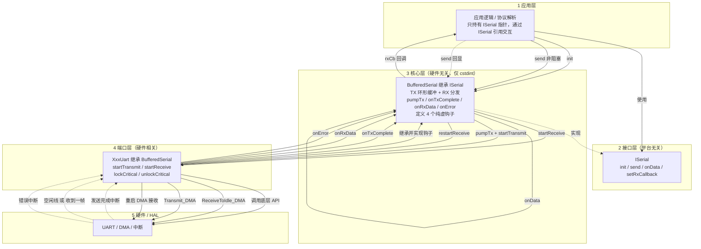

# serial-hal

C++ 串口 HAL 抽象层。**核心与硬件无关**，具体 MCU / 平台通过「端口（port）」接入。

- 核心：`include/iserial.h` + `include/serial_core.h` / `src/serial_core.cpp`
  —— 只依赖 `<cstdint>`，不出现任何 MCU / 寄存器 / 平台特定类型或底层 API。
- 端口：`ports/<平台>/`（如 `ports/stm32/`）—— 硬件相关代码（具体 HAL / SDK 后端）；**核心层完全不含硬件**。

应用 / 业务逻辑只持有 `ISerial*`，通过接收回调拿 `ISerial&`，与具体平台解耦。

## 目录结构
```
include/
  iserial.h        # 平台无关接口 ISerial
  serial_core.h    # 硬件无关核心 BufferedSerial（TX 环形缓冲 + RX 分发）
src/
  serial_core.cpp  # BufferedSerial 实现（无硬件）
ports/
  host/           # 无硬件参考端口（stdout 模拟）
    host_uart.h/.cpp  # HostUart 端口：实现 4 个钩子
  stm32/          # 某 MCU 端口参考实现（含具体 HAL / 底层 API）
    stm32_uart.h/.cpp # Stm32Uart 端口：唯一出现硬件相关类型之处
examples/
  host/
    main.cpp      # 应用示例：只持有 ISerial*，用 ports/host 端口演示收发 / 回显
```

## 核心做了什么（全硬件无关）
- 接收：由硬件层在“收到一帧”时调用 `onRxData()`，核心再转给 `ISerial::onData`
  （默认转发给应用回调，未设回调则原样回发）。
- 发送：`send()` 非阻塞，写入 TX 环形缓冲，再由 `pumpTx()` 驱动硬件发送；
  TX 缓冲空间不足时整帧拒绝（返回 -1），不会发出撕裂的半帧。
  `pumpTx()` 的「查忙 -> 启动」全程在临界区内，可被线程与中断安全并发调用。
- 四个硬件钩子由子类实现：`startTransmit` / `startReceive` / `lockCritical` / `unlockCritical`。

## 用法（应用层只碰接口）
```cpp
#include "xxx_uart.h"    // 换成你用的端口头文件
#include "iserial.h"

ISerial* g_serial = nullptr;
XxxUart u1(...);         // 唯一出现具体类名（板级 glue）

void onRx(ISerial& ser, uint8_t* data, uint16_t len, bool frameEnd) {
    if (frameEnd) { /* 空闲线收尾：完整帧，直接解析 */
    } else {        /* 缓冲压力拆分（HT/TC）：先累积，等 frameEnd 再解析 */
    }
    ser.send(data, len);  /* 应用层只认 ISerial& */
}

u1.init();                // 启动接收
u1.setRxCallback(onRx);   // 注册解析
g_serial = &u1;           // 之后应用层只用 g_serial

g_serial->send((uint8_t*)"hi\r\n", 4);

// printf 重定向（可选）
extern "C" int fputc(int ch, FILE* f) {
    if (g_serial) g_serial->send((uint8_t*)&ch, 1);
    return ch;
}
```

## 接一个新平台（例如某个 MCU）
1. 新建 `ports/<平台>/xxx_uart.{h,cpp}`。
2. 让 `class XxxUart : public BufferedSerial`，实现 4 个虚函数：
   - `startTransmit(data,len)` —— 启动一次异步发送；
   - `startReceive()` —— 启动接收，收到一帧后调用 `onRxData(buf,len)`；
   - `lockCritical()` / `unlockCritical()` —— 保护环形缓冲的临界区。
3. 在硬件的“发送完成 / 收到一帧 / 出错”中断里分别调用
   `onTxComplete()` / `onRxData(...)` / `onError()`。
4. 应用层代码一行都不用改（仍只持有 `ISerial*`）。

## 集成要求（以某 MCU 端口为例）
- 对应平台的 MCU HAL / SDK。
- C++ 工程。
- 编译时加入：`include/`、`src/`、`ports/<平台>/`，并配好底层头文件路径与芯片宏。
- 接收推荐 DMA 循环模式（端口会处理回卷拆帧）；普通模式也可用，
  STM32 端口在每帧后自动重启接收。发送用 DMA 单次模式。
- 帧边界：回调第 4 参 `frameEnd` 区分空闲线完整帧与缓冲压力拆分
  （依赖 HAL `RxEventType`，旧版 HAL 一律按完整帧上报）。
- 溢出防护：HT/TC 保证回调间隔 ≤ 半缓冲；写位置越过保留区
  （默认 RX_SIZE/4）即判定回调饿死，丢弃会话重启并计入 `rxOverruns()`。
  RX_SIZE 建议 ≥ 2×最大帧长。
- 底层“发送完成 / 收到一帧 / 出错”回调由本库内部接管，无需在用户文件里重复实现。

## 架构与调用流程图



> 子图即五层架构，箭头即四条运行时链路（初始化 / 发送 / 接收 / 出错）。
> 依赖方向：应用层 → 接口层 →（核心层定义钩子，端口层继承并实现）→ 硬件层；
> 硬件仅通过 `onTxComplete` / `onRxData` / `onError` 三个回调反向通知端口层，
> 形成依赖倒置。应用层只调用 `ISerial::send` / `setRxCallback`，核心只调 4 个
> 钩子，三方互不依赖具体实现。

## 示例

`examples/host/main.cpp`（配合 `ports/host/`）是一个**不依赖任何硬件**的可运行示例，
用来在 PC 上验证核心逻辑（TX 环形缓冲、RX 分发、回调）。应用层代码只持有
`ISerial*`，与具体端口解耦——和接真实 MCU 时完全一致，仅板级实例化那一行不同。

编译运行（需 g++/clang，已验证 MinGW-w64 g++ 16.2.0）：

```bash
g++ -Iinclude -Isrc -Iports/host \
    src/serial_core.cpp ports/host/host_uart.cpp examples/host/main.cpp \
    -o serial_demo
./serial_demo
```

输出：

```
app received 16 bytes: hello serial-hal
hello serial-halping
```

- `ports/host/host_uart.h/.cpp`：`HostUart` 参考端口，实现 4 个钩子；`startTransmit`
  直接打印到 stdout，`simulateRx()` 用于模拟「外部来帧」触发 RX 回调。
- `examples/host/main.cpp`：应用层只认 `ISerial&`，注册 `onRx` 回调并回显。
- `examples/stm32/`：基于 `ports/stm32` 端口的 MCU 板级集成示例（见其 README）。
- `ports/stm32/stm32_uart.h/.cpp`：某 MCU（STM32 HAL）的端口参考实现，展示
  如何落地 4 个钩子与接管底层中断回调；需用对应芯片 HAL 工程编译。

## 测试（无需硬件）

`tests/` 内置冒烟测试：核心层用 Mock 端口验证 TX 环形缓冲 / RX 分发 /
整帧拒绝 / 回卷流完整性；STM32 端口用假 HAL 头（`tests/fake_hal/`）在 PC 上
覆盖回卷拆帧、普通模式自动重启、错误恢复与临界区嵌套。

```bash
# 核心层 + host 端口
g++ -Wall -Wextra -Iinclude -Isrc -Iports/host \
    src/serial_core.cpp ports/host/host_uart.cpp tests/test_core.cpp \
    -o test_core && ./test_core

# STM32 端口（假 HAL）
g++ -Wall -Wextra -Iinclude -Isrc -Iports/stm32 -Itests/fake_hal \
    src/serial_core.cpp ports/stm32/stm32_uart.cpp tests/test_stm32.cpp \
    -o test_stm32 && ./test_stm32
```

两套全部输出 `ALL PASS` 即通过；改动 `src/`、`ports/` 后建议回归。

更多说明见 `examples/README.md`。
